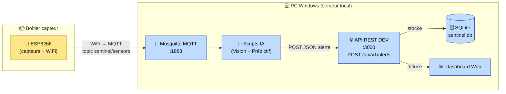
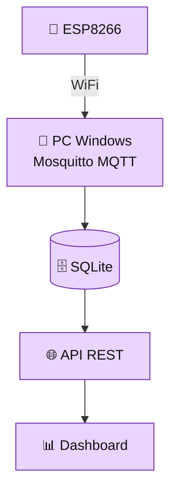
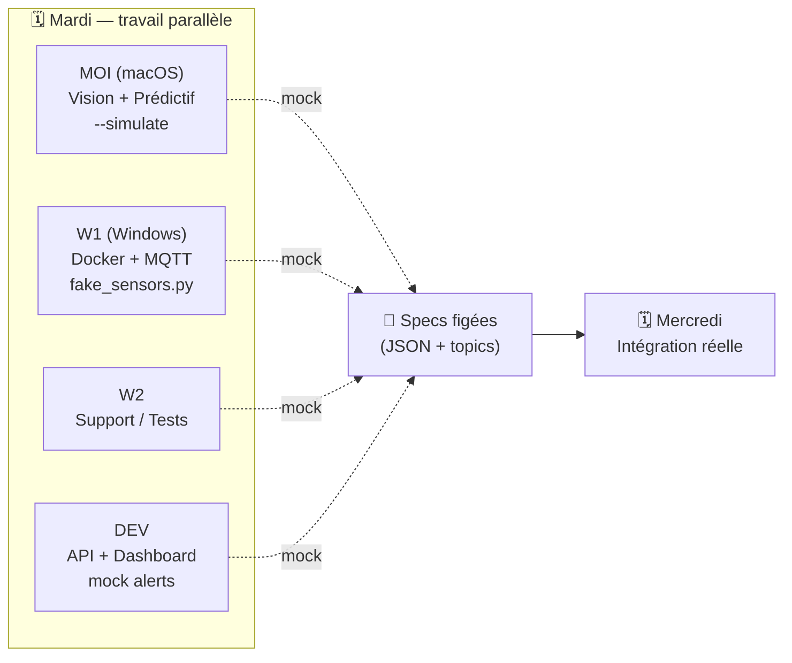

# 🛡️ SENTINEL-X — Brique 0 : Specs d'équipe (prêt à partager)

> **Workshop EPSI BAC+4 — Octobre 2026**
> Document **« prêt à démarrer lundi »** pour toute l'équipe.
> Repo : `sentinel-x-ia` (GitHub).
> **Équipe :** 1 DEV · 1 CYBER · 3 IA/DATA (dont moi, sur macOS).
> **PC Serveur Local :** PC **Windows** (tenu par un·e collègue IA/DATA).

---

## 📑 Table des matières

- [🎯 Contexte en 30 secondes](#-contexte-en-30-secondes)
- [🧩 SECTION 1 — DEV : Ce que tu dois savoir pour commencer lundi](#-section-1--dev--ce-que-tu-dois-savoir-pour-commencer-lundi)
  - [1.1 Où se connecte l'API ?](#11-où-se-connecte-lapi-)
  - [1.2 Format JSON IMMUABLE](#12-format-json-immuable)
  - [1.3 Endpoint obligatoire](#13-endpoint-obligatoire)
  - [1.4 Ce que DEV peut coder sans attendre l'IA](#14-ce-que-dev-peut-coder-sans-attendre-lia)
  - [1.5 Test simple (lundi)](#15-test-simple-lundi)
- [🔒 SECTION 2 — CYBER : Ce que tu dois savoir pour commencer lundi](#-section-2--cyber--ce-que-tu-dois-savoir-pour-commencer-lundi)
  - [2.1 Diagramme réseau simplifié](#21-diagramme-réseau-simplifié)
  - [2.2 Ports à sécuriser](#22-ports-à-sécuriser)
  - [2.3 Ce que CYBER peut faire sans attendre l'IA](#23-ce-que-cyber-peut-faire-sans-attendre-lia)
  - [2.4 Checklist Mercredi (intégration)](#24-checklist-mercredi-intégration)
- [🧠 SECTION 3 — IA/DATA : Brique par brique (lundi → mercredi)](#-section-3--iadata--brique-par-brique-lundi--mercredi)
  - [3.1 Les 7 briques (ordre strict)](#31-les-7-briques-ordre-strict)
  - [3.2 Trois scénarios possibles (sans blocage)](#32-trois-scénarios-possibles-sans-blocage)
  - [3.3 Comment avancer en parallèle (mardi)](#33-comment-avancer-en-parallèle-mardi)
  - [3.4 Mercredi = intégration finale](#34-mercredi--intégration-finale)
- [📘 Ce que j'ai fait](#-ce-que-jai-fait)

---

## 🎯 Contexte en 30 secondes

Un **ESP8266** lit des capteurs et publie en **WiFi/MQTT** vers un **PC Windows** (serveur local). Ce PC héberge **Mosquitto (Docker)**, **SQLite**, les **scripts IA** (Vision YOLOv8 + Prédictif Isolation Forest) et reçoit aussi une **webcam USB**. Toute alerte part en **JSON unifié** vers l'**API REST du DEV** (`localhost:3000`), qui alimente le **Dashboard**.

> 🔑 **Les deux choses qui débloquent toute l'équipe :** le **format JSON immuable** et le **mock data**. Tant qu'on respecte le contrat, chacun code dans son coin sans attendre les autres.

---

## 🧩 SECTION 1 — DEV : Ce que tu dois savoir pour commencer lundi

### 1.1 Où se connecte l'API ?



> 👉 **Ce que tu retiens, DEV :** l'IA ne t'appelle **que** sur `POST localhost:3000/api/v1/alerts`. C'est ton seul point de contact avec nous.

### 1.2 Format JSON IMMUABLE

Ce format est **figé**. Tu l'acceptes **tel quel**, tu ne le modifies pas. Si on doit le changer, ça passe par une décision d'équipe explicite.

```json
{
  "source": "ia_vision | ia_predictive",
  "type": "intrusion_detected | anomaly_detected",
  "confidence": 0.0,
  "timestamp": "2026-10-06T10:30:00Z",
  "details": {}
}
```

| Champ | Type | Valeurs | Immuable ? |
|---|---|---|---|
| `source` | string | `"ia_vision"` \| `"ia_predictive"` | ✅ |
| `type` | string | `"intrusion_detected"` \| `"anomaly_detected"` | ✅ |
| `confidence` | float | `0.0` → `1.0` | ✅ |
| `timestamp` | string | ISO 8601 UTC (`...Z`) | ✅ |
| `details` | object | contenu **libre** selon la source | 🔓 seul champ ouvert |

### 1.3 Endpoint obligatoire

```
POST http://localhost:3000/api/v1/alerts
Content-Type: application/json
```

**Comportement attendu de l'API :**

1. ✅ **Reçoit** le JSON ci-dessus (valider `source`, `type`, `confidence`, `timestamp`).
2. ✅ **Stocke** l'alerte dans **SQLite** (`sentinel.db`).
3. ✅ **Envoie / expose** l'alerte au **Dashboard Web** (GET ou WebSocket, ton choix).

**Réponse attendue :** `201 Created` (ou `200 OK`) + éventuellement un petit corps de confirmation (`{ "status": "ok", "id": 42 }`).

### 1.4 Ce que DEV peut coder sans attendre l'IA

| Tâche | Dépend de l'IA ? |
|---|---|
| ✅ Firmware ESP8266 (capteurs → WiFi → MQTT) | ❌ Non |
| ✅ API REST avec **mock alerts** (données simulées) | ❌ Non |
| ✅ Dashboard Web affichant les **mock alerts** | ❌ Non |
| ✅ Contrôle réactif (buzzer / LEDs sur alerte) | ❌ Non |

> Tu peux coder **100 %** de ta partie avec des fausses alertes au format ci-dessus. Quand l'IA sera prête, elle enverra exactement le même JSON — **rien à changer de ton côté**.

### 1.5 Test simple (lundi)

Lance l'API, puis simule une alerte IA avec `curl` :

```bash
curl -X POST http://localhost:3000/api/v1/alerts \
  -H "Content-Type: application/json" \
  -d '{
    "source": "ia_vision",
    "type": "intrusion_detected",
    "confidence": 0.95,
    "timestamp": "2026-10-06T10:30:00Z",
    "details": {"person_detected": true}
  }'
```

> Si cette requête s'affiche dans ton Dashboard → ton intégration IA est **déjà prête**, avant même que l'IA ait écrit une ligne. 🎉

---

## 🔒 SECTION 2 — CYBER : Ce que tu dois savoir pour commencer lundi

### 2.1 Diagramme réseau simplifié



Tout vit sur le **même PC Windows** (sauf l'ESP8266, relié en WiFi). Le réseau WiFi de la table est le périmètre à protéger.

### 2.2 Ports à sécuriser

| Port | Service | État | Action CYBER |
|---|---|---|---|
| `1883` | Mosquitto **MQTT** | clair (dev) | tolérer lundi/mardi, **fermer en prod** |
| `8883` | Mosquitto **MQTTS** | chiffré (jeudi) | générer certifs, activer TLS |
| `3000` | **API REST** (DEV) | HTTP | restreindre au réseau local |
| `22` | **SSH** | administration | hardening (clés only, pas de mot de passe) |
| WiFi | Réseau table | — | **isoler** `192.168.x.0/24`, WPA2, pas d'accès invité |

### 2.3 Ce que CYBER peut faire sans attendre l'IA

| Tâche | Dépend de l'IA ? |
|---|---|
| ✅ Générer les certificats TLS (pour MQTTS) | ❌ Non |
| ✅ Écrire les règles de pare-feu (UFW / Windows Defender Firewall) | ❌ Non |
| ✅ Configurer les clés SSH | ❌ Non |
| ✅ Documenter la **matrice de sécurité** | ❌ Non |
| ✅ Tester le hardening système | ❌ Non |

> ⚠️ **Note Windows :** le PC serveur est sous **Windows**, donc le pare-feu natif est **Windows Defender Firewall** (UFW est Linux). La logique reste identique : n'ouvrir que `1883`/`8883`/`3000` sur le réseau local, tout fermer d'autre.

### 2.4 Checklist Mercredi (intégration)

- ☐ Appliquer **TLS / MQTTS** sur Mosquitto (bascule `1883` → `8883`)
- ☐ **Fermer** les ports inutiles
- ☐ Vérifier le chiffrement **ESP8266 ↔ PC**
- ☐ **Pentest** mercredi soir (préparer scénarios)

> 🤝 **Point de contact CYBER ↔ IA :** quand tu passes Mosquitto en `8883`, l'IA n'a **que** host/port/cert à changer dans `.env`. Préviens-nous la veille pour qu'on teste la reconnexion TLS ensemble.

---

## 🧠 SECTION 3 — IA/DATA : Brique par brique (lundi → mercredi)

### 3.1 Les 7 briques (ordre strict)

| # | Brique | Créneau | Qui |
|---|---|---|---|
| ✅ | **BRIQUE 0** — Architecture | lundi matin | **DONE** |
| ⏳ | **BRIQUE 1** — Setup Python | lundi 10h | tous |
| ⏳ | **BRIQUE 2** — Docker MQTT | mardi 9h | **W1** (Windows) |
| ⏳ | **BRIQUE 3** — MQTT Client | mardi 10h | **W1 / W2** |
| ⏳ | **BRIQUE 4** — Webcam Capture | mardi 9h | **MOI** (macOS) |
| ⏳ | **BRIQUE 5** — YOLOv8 | mardi 13h | **MOI** (macOS) |
| ⏳ | **BRIQUE 6** — Isolation Forest | mardi 14h | **MOI ou W2** |
| ⏳ | **BRIQUE 7** — API Alerts | mercredi 9h | **intégration** |

### 3.2 Trois scénarios possibles (sans blocage)

#### 🥇 Scénario A — recommandé

| Personne | Machine | Briques |
|---|---|---|
| **Moi** | macOS | 4 + 5 + 6 (Vision + Prédictif) |
| **W1** | Windows | 2 + 3 (Docker + MQTT) |
| **W2** | Windows | Support + tests d'intégration |

#### 🥈 Scénario B — si W2 peut coder

| Personne | Machine | Briques |
|---|---|---|
| **Moi** | macOS | 4 + 5 (Vision) |
| **W1** | Windows | 2 + 3 (Docker + MQTT) |
| **W2** | Windows | 6 (Prédictif) |

#### 🥉 Scénario C — si je fais tout l'IA

| Personne | Machine | Briques |
|---|---|---|
| **Moi** | macOS | 4 + 5 + 6 (Vision + Prédictif) |
| **W1** | Windows | 2 + 3 (Docker + MQTT) |
| **W2** | Windows | Aide DEV (API) + tests |

> **Recommandation : Scénario A.** Il équilibre la charge et garde W2 sur l'intégration (le point le plus risqué mercredi).

### 3.3 Comment avancer en parallèle (mardi)

- ✅ **Mock Data = la clé du déverrouillage.** Chaque brique a un mode `--simulate` : on teste sans attendre l'ESP8266 ni la webcam de l'autre.
- ✅ **Chacun son fichier = pas de conflits Git.** La structure (`vision/`, `predictive/`, `mqtt/`…) sépare les responsabilités → chacun travaille sur ses fichiers.
- ✅ **Specs figées = pas de changement en cours de route.** Le JSON unifié et les topics MQTT ne bougent plus → pas de refonte en urgence.



### 3.4 Mercredi = intégration finale

1. Tout le code **converge** sur la branche `main`.
2. Tests complets avec **données réelles** (ESP8266 + webcam branchés).
3. Système **prêt pour jeudi** (Pentest CYBER).

---

## 📘 Ce que j'ai fait

**En une phrase :** j'ai transformé l'architecture SENTINEL-X en un **document d'équipe GitHub**, découpé par rôle (DEV / CYBER / IA), pour que chacun puisse démarrer **lundi sans attendre les autres**.

**Pourquoi cette structure (une section par rôle) :**
Dans un workshop court, le vrai risque n'est pas technique — c'est le **blocage mutuel** (« j'attends ton code pour commencer le mien »). En donnant à **chaque rôle sa propre section autonome** (ce qu'il peut coder seul, ses tests, ses ports), personne n'est bloqué par personne. Un lecteur DEV lit uniquement sa section et sait quoi faire lundi.

**Pourquoi des specs figées :**
Le **format JSON immuable** et les **topics MQTT** sont des **contrats**. Une fois figés, ils deviennent une interface stable : le DEV code contre un JSON qui ne changera pas, l'IA produit ce même JSON, et les deux se rencontrent sans surprise mercredi. Figer tôt = zéro refonte en urgence. C'est aussi pour ça que `confidence`/`source`/`type`/`timestamp` sont verrouillés et que **seul `details`** reste libre.

**Pourquoi le mock data :**
Le mock data est **le déverrouilleur du parallélisme**. Le DEV teste son API et son Dashboard avec de fausses alertes (`curl`), CYBER sécurise sans attendre l'IA, et l'IA (moi) développe Vision/Prédictif en mode `--simulate` sans webcam ni ESP8266 branchés. Résultat : les 5 personnes avancent **en même temps** mardi, et mercredi on remplace simplement les mocks par du réel. Un seul contrat partagé (le JSON), cinq chantiers indépendants.

**Note de cohérence (macOS vs Windows) :**
Le **serveur** (Mosquitto, API, SQLite) tourne sur le **PC Windows** de W1. Moi je développe **Vision + Prédictif sur macOS**, puis mon code tourne aussi bien sur Windows car il ne dépend que de Python + libs portables (`opencv`, `ultralytics`, `scikit-learn`). Seules différences à gérer : l'ouverture webcam (`cv2.CAP_DSHOW` sur Windows) et les chemins (`pathlib.Path` partout).

---

✅ **Brique 0 (version GitHub) terminée.**
👉 Pour valider : rends le Markdown sur GitHub (le Mermaid s'affiche nativement) et partage le lien à DEV + CYBER + IA + coachs.
📩 Quand c'est validé, dis-moi et on attaque la **Brique 1 — Setup Python + structure projet**.
