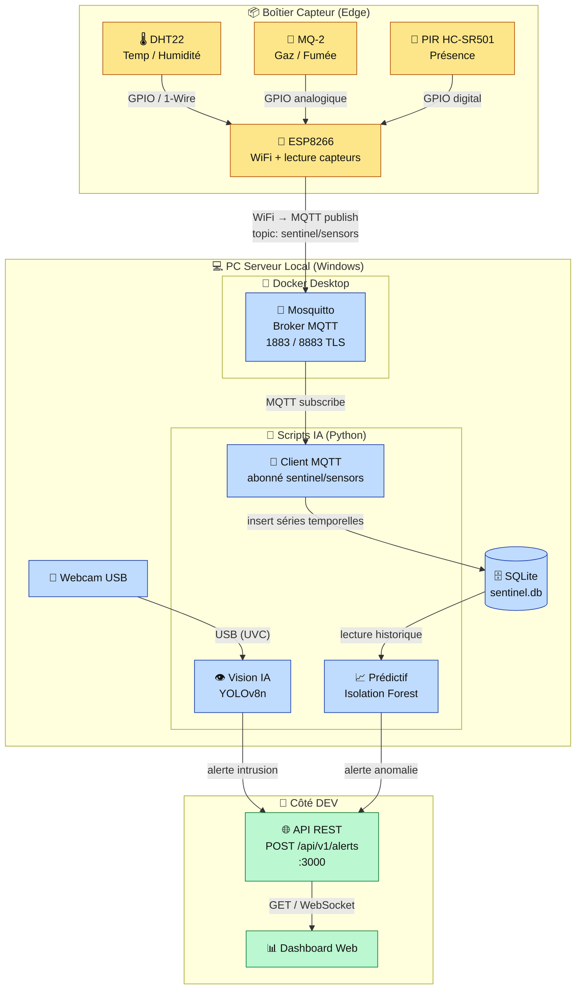
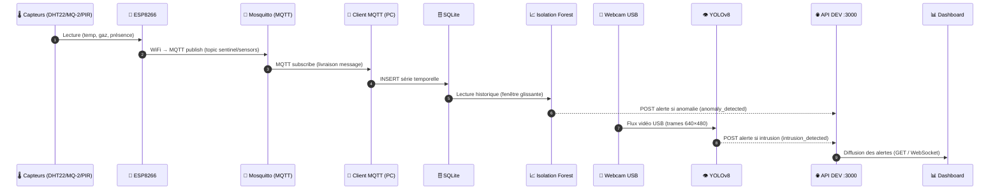
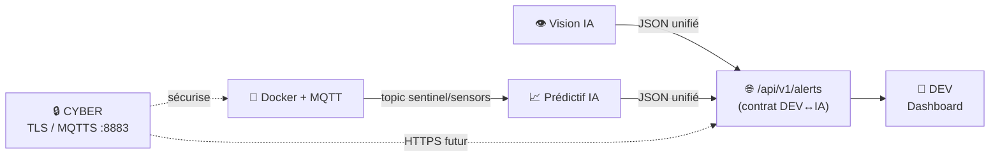

# 🛡️ SENTINEL-X — Brique 0 : Architecture Globale

> **Workshop EPSI BAC+4 — Octobre 2026**
> Document d'architecture **clé en main**, à partager avec les équipes **DEV**, **CYBER**, **IA/DATA** et les **coachs EPSI**.
> Statut : Brique 0 (conception, **aucun code**). Validation requise avant de passer à la Brique 1.

---

## 0. Vue d'ensemble en une phrase

Un **ESP8266** lit des capteurs (température, gaz, présence) et publie en **WiFi/MQTT** vers un **PC Serveur Windows** ; ce PC traite en parallèle un flux **webcam USB** (vision YOLOv8) et les séries temporelles des capteurs (prédictif Isolation Forest), puis envoie toute **alerte** au format JSON unifié à l'**API REST du DEV**, qui alimente le **Dashboard Web**.

C'est une architecture **Edge-to-Server** : le capteur (edge) reste bête et léger, toute l'intelligence (IA) est centralisée sur le PC serveur.

---

## 1. Diagramme d'architecture (Mermaid)



---

## 2. Tableau d'interconnexion

| De | Vers | Protocole | Port / Interface | Responsable |
|---|---|---|---|---|
| DHT22 / MQ-2 / PIR | ESP8266 | GPIO (1-Wire, analogique, digital) | Broches ESP | INFRA / IA-P3 |
| ESP8266 | Mosquitto (PC) | WiFi → **MQTT** (publish) | `1883` (dev) / `8883` (TLS prod) | INFRA / IA-P3 |
| Webcam USB | PC Windows (Vision) | **USB** (UVC) | COM/USB — `cv2.VideoCapture(0)` | IA-P1 (Vision) |
| Mosquitto | Client MQTT IA | **MQTT** (subscribe) | `1883` / `8883` | IA-P3 + IA-P2 |
| Client MQTT | SQLite | Appel local (fichier) | `sentinel.db` | IA-P2 |
| SQLite | Prédictif (Isolation Forest) | Lecture locale | `sentinel.db` | IA-P2 |
| Vision IA | API DEV | **HTTP** (POST JSON) | `3000` → `/api/v1/alerts` | IA-P1 ↔ DEV |
| Prédictif IA | API DEV | **HTTP** (POST JSON) | `3000` → `/api/v1/alerts` | IA-P2 ↔ DEV |
| API DEV | Dashboard Web | **HTTP / WebSocket** | `3000` (ou port front) | DEV |
| CYBER | Mosquitto / API | **TLS / MQTTS** | `8883` + certificats | CYBER |

---

## 3. Distribution des tâches — Équipe IA/DATA (3 personnes)

| Personne | Rôle principal | Briques / Fichiers | Livrables |
|---|---|---|---|
| **IA-P1** | 👁️ **Vision IA** | `vision/capture.py`, `vision/detector.py` | Capture webcam 640×480, détection YOLOv8n « person », alerte `intrusion_detected` |
| **IA-P2** | 📈 **Prédictif + Données** | `predictive/collector.py`, `predictive/model.py` | Stockage séries temporelles SQLite, Isolation Forest (train + predict), alerte `anomaly_detected` |
| **IA-P3** | 🐳 **INFRA Docker/MQTT** (+ infra transverse) | `docker-compose.yml`, `mqtt/client.py`, `simulate/fake_sensors.py` | Broker Mosquitto Docker, client MQTT abonné, simulateur ESP8266, coordination TLS avec CYBER |

> **Transverse à tous :** `config/settings.py` (chargement `.env`), `publisher/alert_sender.py` (format d'alerte unifié), `main.py` (orchestration).

---

## 4. Diagramme de flux de données (Mermaid)



**Résumé des 2 chaînes parallèles :**

- **Chaîne capteurs (prédictif) :** `Capteurs → ESP8266 → WiFi/MQTT → Mosquitto → Client MQTT → SQLite → Isolation Forest → (si anomalie) → API DEV`
- **Chaîne vision :** `Webcam USB → PC → YOLOv8 → (si intrusion) → API DEV`
- **Convergence :** les deux chaînes se rejoignent sur `POST /api/v1/alerts` (format JSON unifié) → `Dashboard`.

---

## 5. Format JSON uniforme des alertes

Toute alerte émise par l'IA respecte **exactement** ce contrat (c'est le point de contact avec le DEV) :

```json
{
  "source": "ia_vision",
  "type": "intrusion_detected",
  "confidence": 0.87,
  "timestamp": "2026-10-05T14:32:11Z",
  "details": {
    "label": "person",
    "bbox": [x, y, w, h]
  }
}
```

**Champs & valeurs autorisées :**

| Champ | Type | Valeurs | Description |
|---|---|---|---|
| `source` | string | `"ia_vision"` \| `"ia_predictive"` | Quelle brique IA émet l'alerte |
| `type` | string | `"intrusion_detected"` \| `"anomaly_detected"` | Nature de l'événement |
| `confidence` | float | `0.0` → `1.0` | Score de confiance du modèle |
| `timestamp` | string | ISO 8601 UTC (`...Z`) | Horodatage de la détection |
| `details` | object | libre selon la source | Métadonnées spécifiques |

**Exemple côté prédictif :**

```json
{
  "source": "ia_predictive",
  "type": "anomaly_detected",
  "confidence": 0.92,
  "timestamp": "2026-10-05T14:35:02Z",
  "details": {
    "sensor": "mq2",
    "value": 812,
    "expected_range": [100, 400],
    "anomaly_score": -0.31
  }
}
```

> **Règle d'or :** le `details` est le **seul** champ libre. `source`, `type`, `confidence`, `timestamp` sont **figés** pour que le DEV n'ait jamais à deviner.

---

## 6. Points d'intégration critiques



1. **DEV ↔ IA — l'API `/api/v1/alerts` :**
   Contrat le plus important du projet. Tant que le JSON unifié (section 5) est respecté, le DEV et l'IA avancent **indépendamment**. À figer en premier avec le DEV.

2. **INFRA ↔ IA — Docker + MQTT :**
   Mosquitto tourne en conteneur Docker. L'IA-P3 fournit le broker + le topic `sentinel/sensors` ; l'IA-P2 s'y abonne. Le **simulateur** (`fake_sensors.py`) permet à l'IA de bosser **sans ESP8266 câblé**.

3. **CYBER ↔ INFRA/IA — TLS / MQTTS :**
   En développement : `1883` en clair. En production (jeudi) : bascule sur `8883` avec certificats fournis par CYBER. Impact IA : juste changer host/port/cert dans `.env`, **pas le code métier**.

4. **IA ↔ IA — comment les briques communiquent :**
   - Vision et Prédictif sont **découplés** : pas d'appel direct entre eux.
   - Ils partagent uniquement : le fichier `.env`/`settings.py`, la fonction d'envoi `alert_sender.py`, et le format JSON unifié.
   - Le point de rendez-vous des données est **SQLite** (prédictif) et l'**API** (sortie commune). Cela permet de développer/tester chaque brique isolément.

---

## 7. Ports & services

| Port / Adresse | Service | Chiffré ? | Usage |
|---|---|---|---|
| `1883` | Mosquitto **MQTT** | ❌ Non | Développement (table de travail) |
| `8883` | Mosquitto **MQTTS** | ✅ TLS | Production (jeudi, certificats CYBER) |
| `3000` | **API DEV** | ❌/✅ selon front | `POST /api/v1/alerts` |
| `5000` | **API IA** (futur) | — | Réservé si l'IA doit exposer un service |
| `192.168.x.x` | **Réseau WiFi** table | WPA2 | ESP8266 ↔ PC + machines équipe |

> **Checklist réseau :** l'ESP8266 et le PC Windows doivent être sur le **même sous-réseau WiFi** (`192.168.x.x`). Le pare-feu Windows doit **autoriser** les ports `1883`/`8883` et `3000` en entrée.

---

## 8. Préparation du PC Windows (serveur local)

| Élément | Exigence | Vérification |
|---|---|---|
| **Python** | 3.9+ (recommandé 3.11) | `python --version` |
| **venv** | Environnement virtuel dédié | `python -m venv .venv` puis `.venv\Scripts\activate` |
| **Docker Desktop** | Installé + démarré (pour Mosquitto) | `docker --version` + `docker ps` |
| **Drivers USB ESP8266** | **CH340** ou **CP2102/FTDI** selon la carte | Apparition d'un port `COMx` dans le Gestionnaire de périphériques |
| **Port COM** | Accès au port série de l'ESP8266 | Visible dans Arduino IDE / Gestionnaire de périphériques |
| **Webcam USB** | Détectée par Windows | Pas de **TCC** comme sur macOS, mais vérifier *Paramètres → Confidentialité → Caméra* → accès autorisé aux applis de bureau |
| **Pare-feu Windows** | Ports `1883`/`8883`/`3000` autorisés | Windows Defender Firewall → règles entrantes |
| **Git** | Pour versionner (sans `.env`) | `git --version` |

**Spécificités Windows à retenir pour l'IA :**
- Chemins : utiliser `pathlib.Path` (jamais de `\` en dur, risque d'échappement).
- Webcam : `cv2.VideoCapture(0, cv2.CAP_DSHOW)` est souvent plus stable sur Windows (évite les lenteurs d'ouverture du backend MSMF).
- Pas de permission TCC (propre à macOS), mais le **réglage Confidentialité Caméra** peut bloquer un script Python : à confirmer au premier lancement.
- `torch` / `ultralytics` : installer la version CPU si pas de GPU NVIDIA/CUDA (suffisant pour YOLOv8n en 640×480).

---

## 📘 Ce que j'ai fait — Brique 0 (Architecture)

**En une phrase :** j'ai posé l'architecture complète **Edge-to-Server** de SENTINEL-X, du capteur jusqu'au dashboard, avec les diagrammes, les responsabilités et les contrats d'intégration.

**Pourquoi cette architecture (Edge-to-Server) :**
Le capteur (ESP8266) est volontairement **« bête »** : il lit et publie, rien de plus. Toute l'intelligence (vision + prédictif) vit sur le **PC serveur Windows**, qui a la puissance CPU nécessaire pour YOLOv8 et scikit-learn. Avantage : un microcontrôleur à 5 € reste suffisant, et on peut faire évoluer l'IA sans retoucher le firmware embarqué.

**Comment chaque composant s'intègre :**
- **ESP8266** = source de données capteurs (edge).
- **Mosquitto (Docker)** = facteur qui distribue les messages (découplage total émetteur/récepteur).
- **Client MQTT + SQLite** = mémoire du système (historique pour le prédictif).
- **YOLOv8 / Isolation Forest** = les deux cerveaux, indépendants l'un de l'autre.
- **API DEV + Dashboard** = sortie unique et visible du système.

**Où les briques IA interviennent dans le flux global :**
Deux chaînes **parallèles et découplées** : la **vision** traite la webcam en direct ; le **prédictif** traite l'historique capteurs stocké en SQLite. Elles ne se parlent jamais directement — elles convergent uniquement sur `POST /api/v1/alerts` avec le **même format JSON**. Ce découplage permet aux 3 personnes IA de travailler en parallèle sans se bloquer.

**Pourquoi MQTT pour les capteurs :**
MQTT est un protocole **léger** (idéal pour un ESP8266 à faible mémoire), en **publish/subscribe** : l'ESP8266 publie sans savoir qui écoute, et l'IA s'abonne sans connaître l'ESP8266. On peut ajouter des capteurs ou des consommateurs sans rien casser. Il supporte nativement le **TLS (8883)** pour la partie CYBER.

**Pourquoi API REST pour les alertes IA :**
Les alertes sont des **événements ponctuels** (intrusion, anomalie) → un simple `POST HTTP` au format JSON est le standard le plus universel et le plus facile à consommer pour le DEV. Contrairement à MQTT (flux continu), REST colle au besoin « un événement = une requête » et rend le **contrat DEV↔IA** trivial à tester (ex. `curl` ou Postman).

**Comment le Windows absorbe la webcam USB :**
La webcam est en **USB direct** sur le PC : Windows l'expose comme un périphérique UVC standard, lu par OpenCV via `cv2.VideoCapture(0, cv2.CAP_DSHOW)`. Pas de réseau, pas de latence WiFi — le flux vidéo reste **local au PC**, ce qui garantit le budget **< 100 ms/trame** en 640×480. Seule vigilance : le réglage *Confidentialité → Caméra* de Windows doit autoriser l'accès.

---

✅ Brique 0 terminée.
👉 Pour valider : ouvre `sentinel-x-ia/BRIQUE0-Architecture.md` dans un lecteur Markdown qui rend le Mermaid (VS Code + extension *Markdown Preview Mermaid*, ou GitHub).
📩 Quand c'est bon, dis-moi et on passe à la **Brique 1 (Setup Python + structure projet)**.
